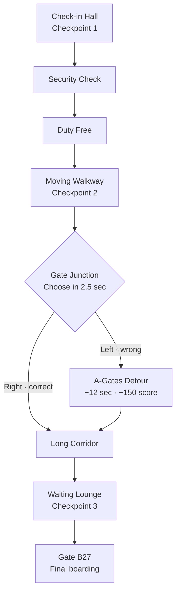

# Level Map

## Segment notes

| Segment | Target time | Core challenge | Primary hazards |
| --- | ---: | --- | --- |
| Check-in | 00:00–00:25 | lane tutorial | suitcase, slow traveler |
| Security | 00:25–00:55 | jump and slide | trays, queue barrier |
| Duty Free | 00:55–01:25 | chained lane changes | display, crossing shopper |
| Moving Walkway | 01:25–01:45 | speed control | cleaning cart, slow door |
| Gate Junction | 01:45–01:55 | navigation | wrong route penalty |
| Long Corridor | 01:55–02:20 | fast combinations | trolley plus barrier patterns |
| Waiting Lounge | 02:20–02:45 | moving slalom | traveler groups and baggage |
| Gate B27 | 02:45–03:00 | final sprint | one readable final pattern |

## Junction behavior

- Required signage: `GATES A1–A20 ←` and `GATES B21–B40 →`.
- Target gate B27 makes the right branch correct.
- Wrong choice enters a short recovery loop.
- Apply the time and score penalty once when entering the detour.
- The recovery route must not contain more coins than the correct route.
- Both branches reconnect before the Long Corridor.

